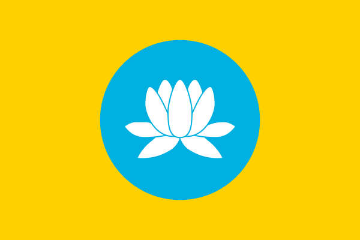
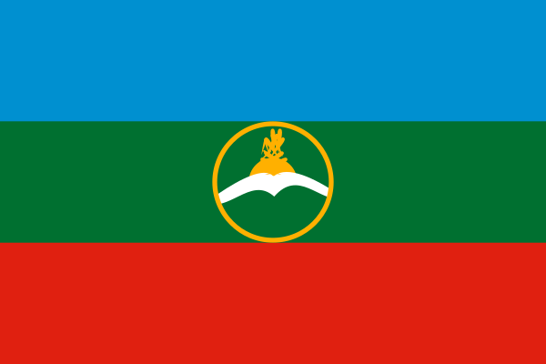
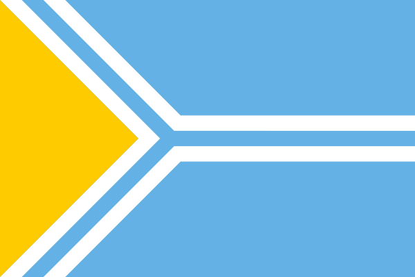
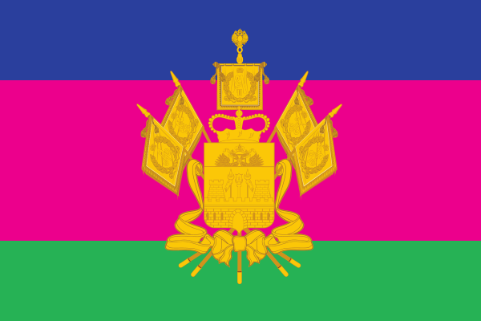
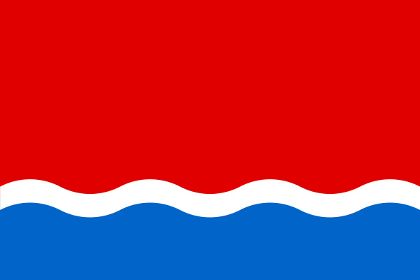
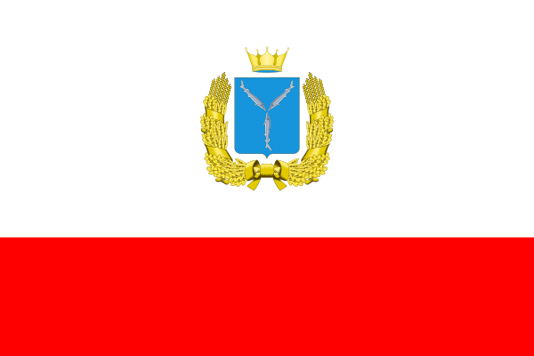
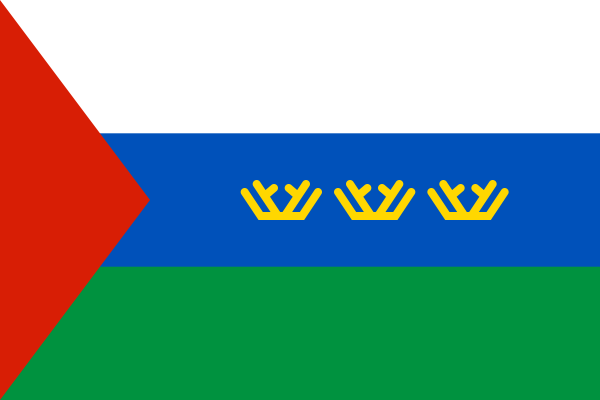

## Флаги регионов России

Коллекция изображений флагов 85 субъектов Российской Федерации в формате SVG.

Исходные файлы получены из Wikipedia. Все изображения приведены к соотношению сторон 3x2 и оптимизированы.

Файлы именуются в соответствии с буквенными кодами субъектов РФ стандарта [ISO 3166-2](https://ru.wikipedia.org/wiki/%D0%9A%D0%BE%D0%B4%D1%8B_%D1%81%D1%83%D0%B1%D1%8A%D0%B5%D0%BA%D1%82%D0%BE%D0%B2_%D0%A0%D0%BE%D1%81%D1%81%D0%B8%D0%B9%D1%81%D0%BA%D0%BE%D0%B9_%D0%A4%D0%B5%D0%B4%D0%B5%D1%80%D0%B0%D1%86%D0%B8%D0%B8).

Согласно статье 1259 части 4 Гражданского кодекса РФ, ФЗ №230 от 18 декабря 2006г, государственные символы и знаки (флаги, гербы, ордена, денежные знаки и тому подобное), а также символы и знаки муниципальных образований не являются объектами авторских прав.

    
    
    
    
    
    
    
    
    
    
    
    
    
    
    
    
    
    
    
    
    
    
    
    
    
    
    
    
    
    
    
    
    
    
    
    
    
    
    
    
    
    
    
    
    
    
    
    
    
    
    
    
    
    
    
    
    
    
    
    
    
    
    
    
    
    
    
    
    
    
    
    
    
    
    
    
    
    
    
    
    
    
    
    
    

